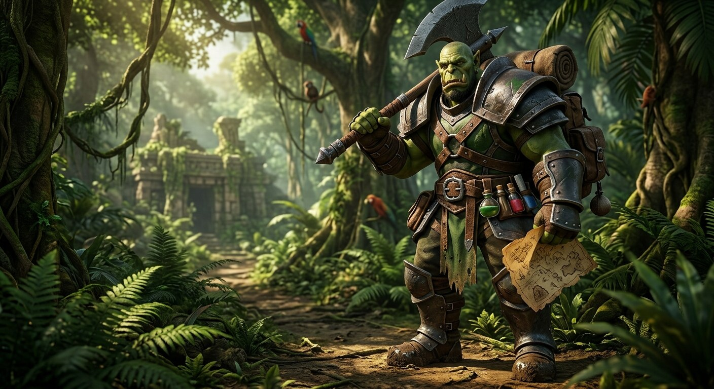

# WiggleUI

An interface for TBC Anniversary (2.5.6) and Classic Era (1.15.9). It draws your
unit frames, your action bars, your bags, your character sheet, your quest log,
your map, your mail and most of the other windows the client has, and about a
dozen readouts neither client has ever had.

Shake the mouse left and right and the whole screen changes. That is the gesture
it is named after, and [the guide](docs/guide/README.md) starts there.

## The guide

The player guide used to be this file, all eight hundred lines of it. It is
[docs/guide/](docs/guide/README.md) now, one page per group in the settings
window, because a single page is a single page whatever you put on it.

- [Install](docs/guide/install.md), and what Questie adds
- [The first login](docs/guide/first-run.md)
- [Moving things, themes and profiles](docs/guide/look.md)
- [Fighting](docs/guide/fighting.md)
- [Action bars](docs/guide/bars.md)
- [Frames](docs/guide/frames.md)
- [Windows](docs/guide/windows.md)
- [Feeds and meters](docs/guide/feeds.md)
- [Chores](docs/guide/chores.md)
- [The screen itself](docs/guide/screen.md)
- [Every command](docs/guide/commands.md)
- [When something is wrong](docs/guide/troubleshooting.md)

## Repo layout

    src/        the addon, exactly what the client loads
    src/Media/  the art and fonts the addon ships: the icon, two typefaces
                and the nine pieces of each of the six painted frames
    docs/       the engineering notes, including the file map and API caveats
    docs/guide/ the player guide, which is the text above this section
    plan/       the open work, read and written with ckplan
    scripts/    check.sh, bake-ui.sh, release.sh, deploy.sh
    art/        the project art: the banner above, the avatar, the plaque

`art/` is for GitHub and the CurseForge project page and is not shipped, which
is what separates it from `src/Media/`. The client reads BLP and TGA, so a JPEG
in the addon folder would be dead weight.

`src/` is what a client sees. Link it in rather than copying, so there is one
copy to edit and every client loads it:

    ln -s "$PWD/src" "/path/to/World of Warcraft/_anniversary_/Interface/AddOns/WiggleUI"

## Developing

    ./scripts/check.sh

Syntax, TOC agreement, version agreement, saved-variable declarations, a guard
check on every write reachable from an OnUpdate, luacheck, the shape and tree
metrics, and the harness. Zero warnings and zero errors is the bar, and it
passes, so any finding is yours.

`scripts/hooks/pre-commit` runs the same gate, and `core.hooksPath` points at
`scripts/hooks`. If a commit went through without a gate summary, check that
setting first.

    ./scripts/bake-guide-commands.sh           write docs/guide/commands.md
    ./scripts/bake-guide-commands.sh --check   exit non-zero if it is stale

The command reference is baked out of the `help` tables in every `Feature.lua`,
which is the same text `/wui help` prints. Hand maintaining a hundred and eighty
commands is how the old reference came to list `/wui loadout` five months after
the weapon loadouts came out.

    ./scripts/release.sh

Builds `dist/WiggleUI-<version>.zip`. Add `--upload` to publish it to
CurseForge. It refuses to build anything if `check.sh` fails.

    ./scripts/deploy.sh

release.sh with the project id and the token filled in. It bumps the version,
gates, builds, uploads as a beta, then commits and tags. `--type alpha` and
`--type release` are the other two, and release has to be typed.

Version lives in three places on purpose, `ns.version` in `src/Core/Core.lua` and
`## Version:` in both TOCs. `check.sh` fails if they drift, which is how the
1.1-versus-1.2 split got caught.

## Licence

MIT. See `LICENSE`.
