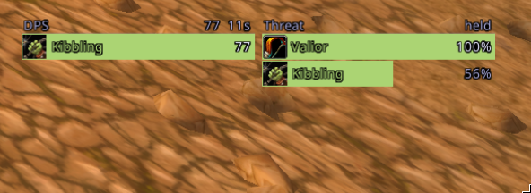
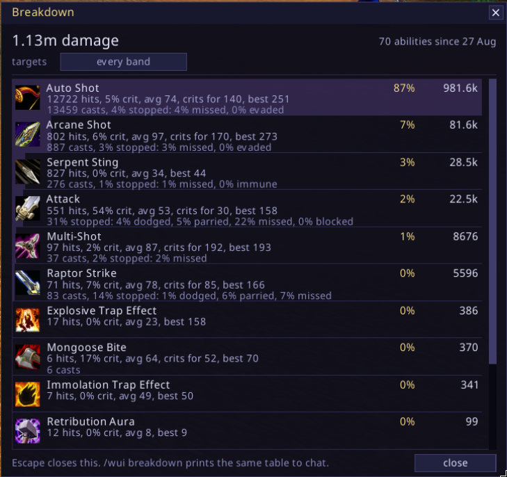

# Feeds and meters

**A loot stream, and the combat log beside it.** Two columns of what just
happened, newest at the top and older underneath, scrolled with the wheel. A
loot row is the item's icon, its name in its own quality colour and how many
dropped, with a stripe down the left in that same colour, so a pull reads as a
ribbon before you read a word of it. A quest item carries a ring round its icon,
because a quest item is white and so is a stack of linen. The loot feed has no
word over it and no line round it, and over the rows are seven small squares:
five gems in the quality colours, a quest bang and a stack of coins. Click one
and that kind stops being drawn. They filter what you are looking at rather than
what is recorded, so turning one back on brings its history with it. Hover a row
and the tooltip carries what a vendor pays for one and what the stack came to,
plus what it goes for at auction if you have Auctionator, TSM, Auctioneer or
RECrystallize installed. None of them is required and the line names whichever
answered.

A combat row is three columns off the combat log: what happened, who it was, and
the number. The stripe says which way the blow went and a critical draws its
number in gold with a mark after it, so the crit is not a hue you have to be
able to see. Entering and leaving combat draw a band across the feed, which is
what separates one pull from the one before it, and the band at the end says how
long the fight took. Both feeds are the same widget, and adding a third is a
file that captures something and a table of settings.

Nothing in either feed is on a ticker: they change when something happens to you
and when you scroll them, and never in between.

    /wui feed loot on|off, feed combat on|off, feed <which> show|hide
    /wui feed <which> rows 3 to 24, width 200 to 520, icon 16 to 40, zoom 1 to 3
    /wui feed <which> alpha 0 to 100, mouse|header|edge on|off
    /wui feed loot group on|off, purse on|off
    /wui feed combat out|in|misses on|off, floor 0
    /wui feed <which> clear, feed <which> reset

**A damage meter and a threat meter, side by side.** One row per player: the spec
icon, the name, the number, and a class-coloured bar as long as their share of
the top row. Click the header for the breakdown of your own damage, right click
it to swap damage for healing. The threat side is the client's own percentage,
where 100 means that player takes the mob, and beside it the seconds until they
get there at the rate they are gaining. Nothing is drawn but the rows, so it
sits on the screen rather than over it. A row opens nothing, because there is
nothing behind a row.

    /wui meter on|off, meter dps|hps, meter threat on|off
    /wui meter rows 3 to 10, width 120 to 400, zoom 1 to 3, alpha 15

**A breakdown of what this character actually does.** One row per ability, kept
between sessions: how much of your damage it is, how often it lands, how often
it crits, what it averages, and what stopped it when it did not land. The miss
column names the outcome rather than pooling it, because a dodge and a parry
mean different things and dodge is the one you can do something about. Shouts,
stances and Charge are counted but not listed, since in a damage ranking they
are a run of zeroes above the rows you came to read.

It answers the questions a meter cannot, because a meter forgets the pull it was
counting: whether Slam pays for the swing it costs, what share of your damage
comes from Thunder Clap, whether that new axe changed anything. Rows can be read
one level band at a time, since in this era the target's level drives crit and
miss hard and a number pooled across grey trash and an elite is the average of
two unrelated things.

    /wui breakdown open, and Escape closes it
    /wui breakdown, the top ten to chat
    /wui breakdown on|off, breakdown top 20, breakdown band all|<band>
    /wui breakdown reset yes

**Numbers floating off your character.** What you land falls left, what lands on
you falls right, healing rises. Damage is white, healing green, a big hit gold, a
miss grey. A word appears above your head the moment an ability comes up, once.

    /wui hits on|off, hits size 30, fall 90, curve 44, time 1.3
    /wui hits merge on|off, calls on|off, quiet on|off
