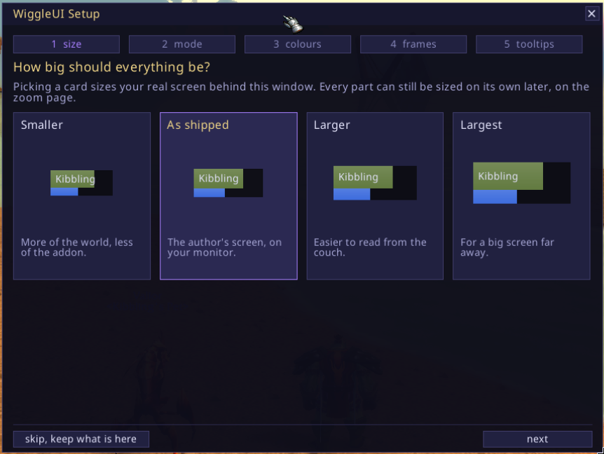
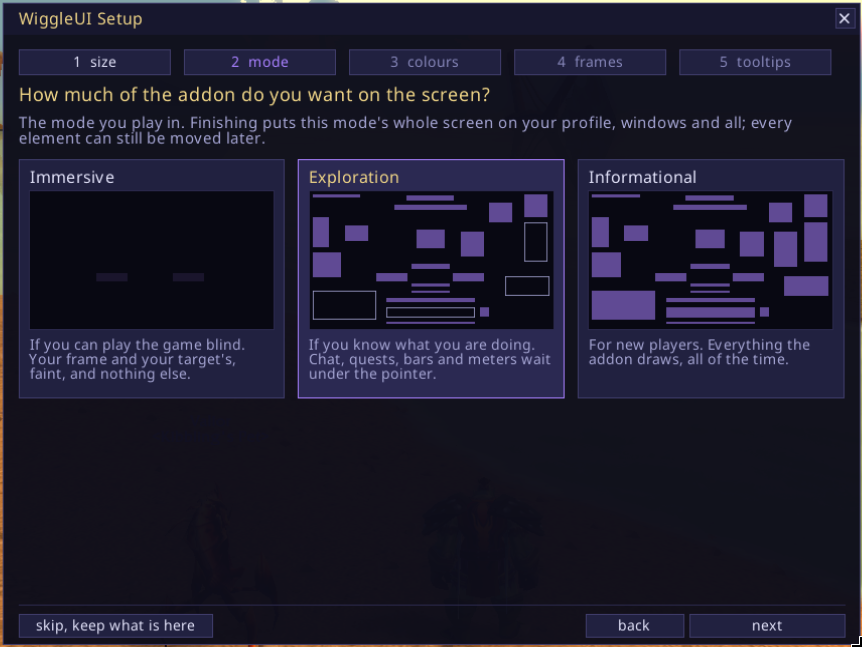
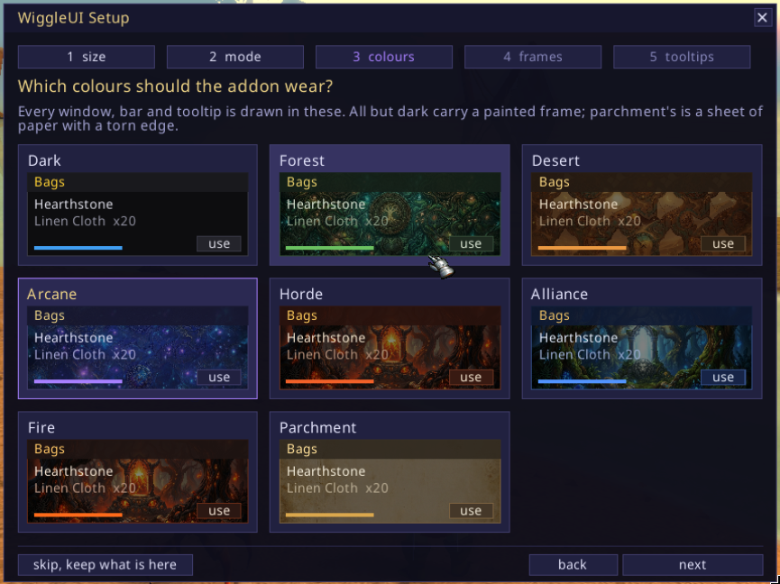
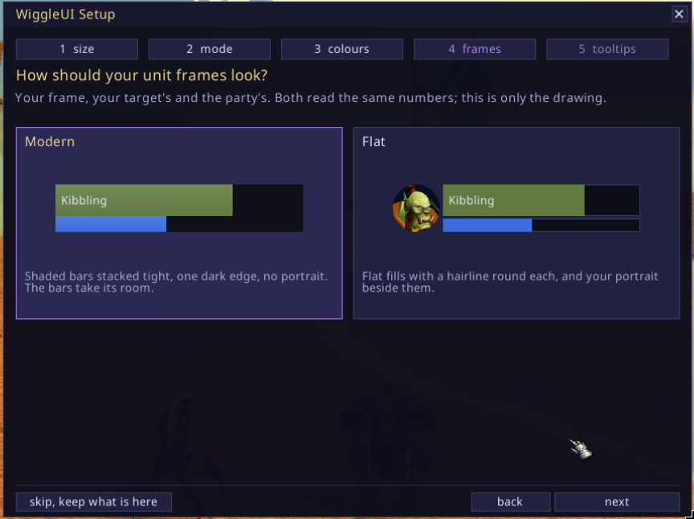
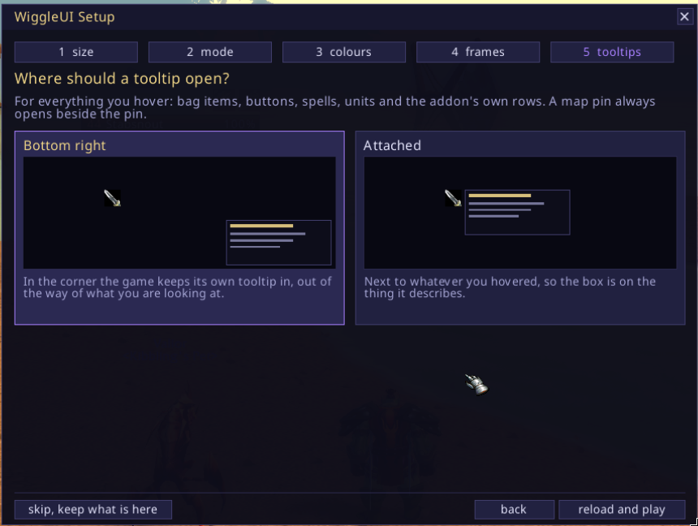
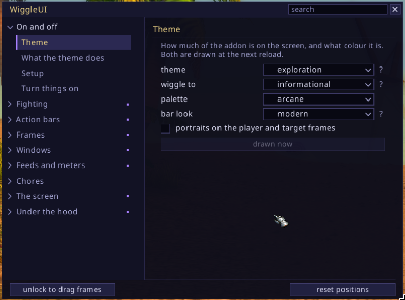

# The first login

The first time you log in, five cards come up, one question each, with a picture
of the answer on every card.

1. **How big should everything be.** Picking a card sizes the real screen behind
   the window while you look at it. Four stops, from smaller to largest, and
   every part can still be sized on its own later.

   

2. **How much of the addon do you want on the screen.** This is the theme:
   immersive, exploration or informational. They run from the one that shows
   least to the one that shows most, which is also from the player who knows the
   game best to the one who is new to it.

   

3. **Which colours should the addon wear.** Dark, forest, desert, arcane, horde,
   alliance, fire or parchment. All but dark carry a painted frame round every
   window; parchment's is a sheet of paper with a torn, scorched edge.

   

4. **How should your unit frames look.** Modern is shaded bars stacked tight
   with one dark edge and no portrait, the bars taking the portrait's room. Flat
   is flat fills with a hairline round each and your portrait beside them.

   

5. **Where should a tooltip open.** In the corner the game keeps its own tooltip
   in, or attached to whatever you hovered. A map pin is attached either way,
   because a box in the screen's corner is a long way from the pin it names.

   

Nothing is written until you finish the last page. Skipping, closing the window
or pressing Escape keeps what you have, which on a fresh install is the shipped
screen, and the setup never comes up on its own again.

Finishing reloads the interface if the mode, the colours or the frames moved,
because those three are drawn once at load. It also lays the chosen mode's
shipped screen over this character's profile, windows and sizes included, so
picking immersive gives you the author's immersive screen rather than the
informational one with things hidden.

To answer them again, type `/wui setup`, or press Escape and take **WiggleUI
Setup** from the game menu. It starts on your current answers rather than on the
shipped ones.

## Getting around

`/wui` opens the settings window and `/wui` again closes it.

Down the left is a rail of nine groups, and a tenth named after your class if
your class has pages nobody else does. A group is a thing you can point at on
the screen or a job you came to do: On and off, Fighting, Action bars, Frames,
Windows, Feeds and meters, Chores, The screen, Under the hood. The group you are
in stands open with its sections listed under it and the rest stay one line
each.

The window opens on **On and off**, which is one switch per part of the addon
and a sentence saying what turning it on puts on your screen. Nothing else is on
that page: no numbers, no ranges. Turn things on, go and look at your screen,
come back. The same switch sits at the top of that part's own page with its
numbers under it.

There is a search field above the page. Type into it and it lists every control
in the window that matches, wherever it lives, and taking one takes you to its
page with the control marked. It takes the keyboard when you click it and at no
other time.

Two commands are worth knowing before the rest:

    /wui help      every word the addon answers, one line each
    /wui status    what every part is doing right now

`/wui` is also `/wiggleui` and `/wiggle`, if the short one is taken.

<!-- nav -->
---

Previous: [Install](install.md) | [All pages](README.md) | Next: [Themes, placing and profiles](look.md)
